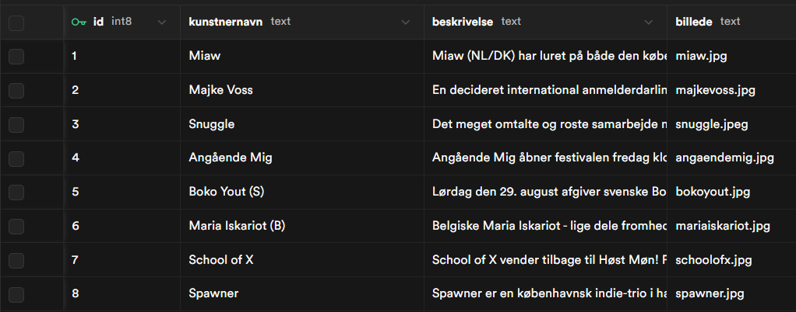

#### Teknisk dokumentation - Gruppe 11

# Høst Møn

## Om Projektet

I dette projekt kommer vi med vores forslag til hvordan Høst Møns hjemmeside kunne se ud og fungere. For at lave hjemmesiden har vi først idéudviklet og designet i Figma, og siden har vi kodet løsningen vha. Astro. Udover Astro har vi brugt Supabase til at lave en database, som vi bruger i løsningen.

### Links

- GitHub repository: https://github.com/SaethorMH/Hoestfestival
- Netlify host: https://hoestfestival.netlify.app/
- Figma: https://www.figma.com/design/P5ca9eA4TnJ4tSCS5KipeT/H%C3%B8st-M%C3%B8n?node-id=490-1873&t=ROxyuhbm3PGo7U8n-0

---

## Projektstruktur

```
project/
├── *astro filer*
├── .env
├── src/
│   ├── pages/
│   │     ├── index.astro
│   │     ├── program.astro
│   │     ├── arkiv.astro
│   │     ├── om.astro
│   │     └── pladsen.astro
│   ├── layout/
│   │     └── Layout.astro
│   ├── styles/
│   │     └── global.css
│   └── components/
│         ├── Footer.astro
│         ├── Header.astro
│         ├── HeroSection.astro
│         └── KunstnerKort.astro
│
├── public/
│   ├── images/
│   │     └── alle billederne
│   ├── font/
│   │     ├── londrinasolid-regular-webfont.woff2
│   │     └── ...
│   └── andre filer der skal være tilgængelige.
├── .gitignore
└── README.md
```

---

# Filbeskrivelser

### Pages

- index.astro – Forsiden.
- program.astro - Indeholder kunstnerne der optræder over festivallen.
- arkiv.astro - Indeholder tidligere års lineup samt billeder taget det år.
- pladsen.astro - Indeholder bl.a. praktisk information om hvordan pladsen kommer til at være og måltidet der servers.
- om.astro - Indeholder oplysninger om Høst Møn og hvordan man bliver frivilig.

### Components

- KunstnerKort.astro - Billede og navn på kunstner fører til om dem i programmet.
- HeroSection.astro - Starten på hver side ser ens ud med lidt forskelligt indhold.
- Header.astro og Footer.astro - Header- og footerdelene der går igen på alle siderne.

---

# Astro

Astro er et web-framework man bruger til at lave veloptimerede hjemmesider. En af fordelene ved at bruge astro er dets komponent system, hvor man definerer en underdel eller et element af en side som man bruger flere gange ét sted og siden kun "kalder" på det der hvor den skal være, dermed sparer man at have stort set den samme kode mange gange.

## Komponenter

Komponenter består af to dele:

#### Frontmatter

Alt det der er inde for "---" (Fences), her kan man lave variabler og importere f.eks. andre komponenter.

#### Template

Alt efter "---", her skriver man normal HTML og Javascript.

### Eksempelvis:

```astro
---
//Frontmatter
const { title, text } = Astro.props;
---
<div class="eksempelElement">
  <h3>{title}</h3>
  <p>{text}</p>
</div>

<style>
.eksempelElement{
    //Styling der kun gør sig gældende inde i komponenten
}
</style>
```

Så i den page/dokument man vil have overstående komponent, skal man først importere det i sidens frontmatter.

```astro
---
import EksempelKomponent from "../components/EksempelKomponent.astro"
---
```

Når komponenten er importet kan man indsætte den i koden der hvor den skal være.
Det vil se således ud:

```astro
<EksempelKomponent title="Overskrift1" text="bla bla bla..." //her er det man definere hvad de interne variabler skal være />
```

# Supabase

Supabase er en database-hosting løsning hvor man kan lave, redigere, opdatere egne databaser og trække fra dem til sine egne projekter.

## Databasen

I supabase kan man lave tabeller med rækker af objekter der alle indeholder de samme koloner af variabler.
Her er vores database som eksempel:


## Hente fra databasen

For at hente objekterne fra databasen skal der være et par ting på plads.

### .env

Man skal have en .env fil i rodden af sit projekt som indeholder nogle af de adgangsgivende oplysninger man skal bruge for at kunne komme ind i databasen. I den står der

```
PUBLIC_SUPABASE_URL=https://eksempel.supabase.co
PUBLIC_SUPABASE_PUBLISHABLE_KEY=sb_publishable_eksempel_eksempel_qC6-Ltmd
```

Det er vigtigt at denne fil er i .gitignore, da den af sikkerhedsmessige årsager ikke skal være tilgængelig for alle.

### Frontmatter

I den fil hvor data'en skal hentes skal der være følgende kode.

```astro
---
const url =`${import.meta.env.PUBLIC_SUPABASE_URL}/rest/v1/Kunstnere?select=*`; //URL til databasen /v1/Kunstnere.. vil være anderledes mellem projekter.
const apiKey = import.meta.env.PUBLIC_SUPABASE_PUBLISHABLE_KEY; //Nøglen man bruger til at få lov at tage fra databasen
const options = {
  headers: {
    apikey: apiKey,
  },
}; //Man sender nøglen med når man henter data'en.
const data = await fetch(url, options)
  .then((res) => res.json()); //bearbejder så man kan bruge data'en
---
```

Efter det har man data som man kender det fra andre json databaser.

### Workflow

1. Pull seneste version
2. Lave en branch med et beskrivende feature-navn eller med eget navn
3. Kode en feature
4. Committe ændringer
5. Pushe til GitHub

Gentag 3-5 til man er færdig.

6. Merge til main når det virker helt som det skal

---

## Mulige forbedringer

- Færdiggørelse

## Gruppemedlemmer:

- Nicolai
- Joakim
- Sæthor
